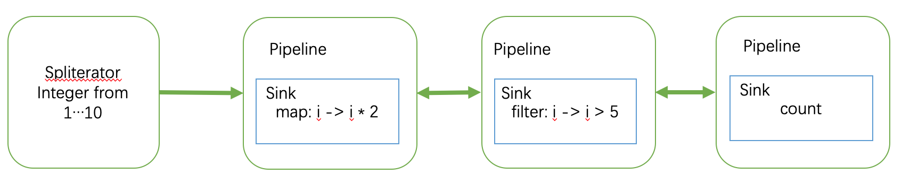

# Java Stream API 实现详解

自 Java 8 后，Stream API 成为了开发中必不可少的元素。相比于原始的 for-loop 循环，Stream API 拥有更好的可读性和更好的通用性能。但是 Stream API 本身引入了更复杂的抽象结构和更多的类创建开销，使用不当的话，很容易使性能劣化或者导致 BUG。因此开发有必要更深入地理解 Stream API 的原理和实现。本文将从 Stream API 的抽象设计到代码实现，从简单的单线程模型到并行运算，详细地介绍 Stream API。


## Sink 和 Pipeline

在 Stream API 的抽象设计中，Spliterator， Sink 和 Pipeline 位列核心。

Spliterator 是数据源。它是一个定制化的 Iterator，除了提供数据遍历的功能外，还要负责分解数据（即 Split）。当调用并行流时，Spliterator 负责把数据分解成一个个更小的 Spliterator，然后利用 Java 自带的 ForkJoinPool 框架并行计算。  

Sink 是操作的容器。例如 map, reduce 或者 filter 的具体行为。  

Pipeline 是流水线的一环。Pipeline 中储存了某个具体的 Sink。当数据流过 Pipeline 时，Pipeline 就会调用 Sink 加工出具，加工完毕后数据传递到下一个 Pipeline。  

下方是一个典型的 Stream API 用法：

```java
IntStream.range(1, 10)
         .map(i -> i * 2)
         .filter(i -> i > 5)
         .count();
```

上方代码生成了下方图片所示的一个数据结构（为了说明简洁，放弃了部分准确性）。
`.range(1, 10)` 创建了一个遍历1到10的 Spliterator。 `.map().filter().count()` 构建了3个节点的双向链表。当流开始执行时，数据从 Splitertor 流出，顺着链表往下流动。



## 源代码分析

Stream API 实现较为负责。阅读代码时请暂且忽略本文没有说明的细节。相关细节会在后续文章中逐渐剖析。

### range()
```java
// https://github.com/openjdk/jdk/blob/master/src/java.base/share/classes/java/util/stream/IntStream.java#L1041-L1048
public static IntStream range(int startInclusive, int endExclusive) {
    if (startInclusive >= endExclusive) {
        return empty();
    } else {
        return StreamSupport.intStream(
                new Streams.RangeIntSpliterator(startInclusive, endExclusive, false), false);
    }
}
```

`IntStream.range()` 创建并返回了一个 IntStream（`StreamSupport.intStream`）。此 IntStream 为流水线的起点（由于此节点不承担任何工作，在上方图片中为了说明简洁而被隐去）。并且通过调用`new Streams.RangeIntSpliterator()`创建了一个RangeIntSpliterator。显而易见地，此 Spliterator 提供 [1,10) 的 Int 数据。

此步过后，我们有了流水线链表的数据源和头节点。

### map()/filter()
```java
// https://github.com/openjdk/jdk/blob/master/src/java.base/share/classes/java/util/stream/IntPipeline.java#L236-L251
@Override
public final IntStream map(IntUnaryOperator mapper) {
    Objects.requireNonNull(mapper);
    return new StatelessOp<Integer>(this, StreamShape.INT_VALUE,
                                    StreamOpFlag.NOT_SORTED | StreamOpFlag.NOT_DISTINCT) {
        @Override
        Sink<Integer> opWrapSink(int flags, Sink<Integer> sink) {
            return new Sink.ChainedInt<Integer>(sink) {
                @Override
                public void accept(int t) {
                    downstream.accept(mapper.applyAsInt(t));
                }
            };
        }
    };
}
```

`.map()` 创建并返回了一个 StatelessOp。StatelessOp 实现了 IntStream 接口。为了行文方便，请容我先一律不管 IntStream 的各类实现，一律称呼 IntStream 的各子类为 IntStream。在创建 IntStream（StatelessOp）的时候，其构造函数的第一个参数为 upstream，提供了双向链表中指向前一个节点的引用。

IntStream 实现了 `opWrapSink` 接口。实现此接口的时候，IntStream 创建一个 Sink。Sink 定义了一个 accept 方法。该方法就是流操作中 map 动作的具体行为。

```
downstream.accept(mapper.applyAsInt(t));
```

此处 mapper 为调用 `.map(i -> i * 2)` 时传入的 Lambda 函数，也即 `i -> i * 2`。
`mapper.applyAsInt(t)` 调用了 `i -> i * 2` 函数并取得结果。然后通过 `downstream.accept()` 把结果传递到流操作的双向链表的下一个节点。

filter() 的代码实现基本相同，这里不再赘述。

### count()

```java
// https://github.com/openjdk/jdk/blob/master/src/java.base/share/classes/java/util/stream/IntPipeline.java#L463-L465
@Override
public final long count() {
    return evaluate(ReduceOps.makeIntCounting());
}
```

`ReduceOps.makeIntCounting()` 创建了一个 `CountingSink`。
代码中因为各种原因包了好几层。这里先贴出 CountingSink 的实现代码。与 map() 和 filter() 没有太大差异。简单直白的一个 `count++` 实现了流中的元素计数功能。

```java
// https://github.com/openjdk/jdk/blob/master/src/java.base/share/classes/java/util/stream/ReduceOps.java#L827-L832
static final class OfInt extends CountingSink<Integer> implements Sink.OfInt {
    @Override
    public void accept(int t) {
        count++;
    }
}
```

但是在 `count()` 中，我们看到了一个 map() 和 filter() 中没有的函数调用 —— `evaluate()`。
再看一眼 map()，filter() 的源代码，我们发现 map() 和 filter() 只是在不停地 new 新的匿名 Stream。在创建新的匿名 Stream 时，我们定义了如何构造 Sink。从始到终我们都触发发流的执行动作。

而 `evaluate()` 正是通知流可以执行操作的关键。
